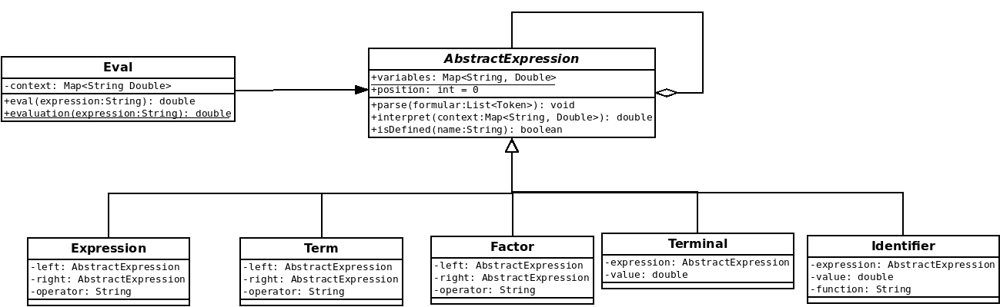

# Skeleton Parser Interpreter Pattern

Simple Parser and Interpreter (implemented with Interpreter Pattern)

## Simple Expressions

Something like `3.14*(2.0*sqrt(-3*-12.3)+12)`

```
<Expression> ::= <Term> | <Term> ('+' | '-') <Expression>
<Term> ::= <Factor> | <Factor> ('*' | '/') <Term>
<Factor> ::= <Terminal> | <Terminal> '^' <Factor>
<Terminal> ::= ['+' | '-'] (<Number> | <Variable> | <Constant> | <Function> | '(' <Expression> ')')

<Function> = <Identifier> '(' <Expression> ')'
```
## Parser - Interpreter Pattern



### Eval

Class using `parse()` and `interpret()` of `AbstractExpression` to parse and 
interpret an expression.

### AbstractExpression and Subclasses

This parser is partly implemented and should be completed.
